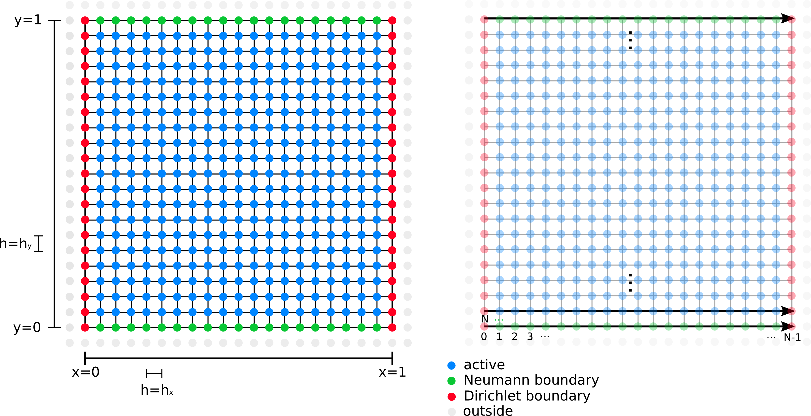

# Exercise 2: Performance Benchmarks, Finite Difference Discretization

- **Handout: Thursday, November 07, 3pm**.
- **Handin until: Thursday, December 5, end of day**, group submission via [TUWEL](https://tuwel.tuwien.ac.at/course/section.php?id=783875).
- Include the name of all group members in your documents.
- Do not include binary executables **but** build instructions (for GNU/Linux).
- Include any scripts you used to generate the plots from your recorded data.
- Submit your report (including plots/visualizations) as one `.pdf`-file per task.
- Submit everything as one `.zip`-file.

## Task 1. Benchmark Vector Triad (1 Point)

You benchmark below *Vector Triad* on your system utilizing the provided C++ source code in [`task1/main.cpp`](task1/main.cpp).

```
// pseudocode
for i from 1 to N do
    A[i] = B[i] + C[i] * D[i]
```

Adopt the provided source code to your needs (i.e. by changing/extending the dimensions of the vectors to better reflect the cache sizes of your system, or changing the way results are reported).
More specifically you should

1. create a plot displaying your results: vector length (x-axis) vs. FLOPS/s (y-axis),
2. indicate the cache sizes of your system (i.e., add vertical lines where the cumulated memory footprint of all four vectors equals the respective cache level size), and
3. discuss your results

## Task 2. Estimate and Benchmark the Performance of dense Matrix-Matrix Multiplication

You estimate and benchmark the performance of different implementations of dense matrix-matrix multiplication (MMM) executed using a single thread.

### 2.1 Estimating/Modeling (1 Points)

- Calculate a theoretical single threaded *machine balance* $B_m = \frac{\text{memory bandwidth [Byte/s]}}{\text{peak performance [FLOPs/s]}}$ for the CPU which you will later use for benchmarking.
- Calculate the *code balance*, i.e. the ratio of the size of the data which needs to be accessed and the required number of FLOPs $B_c = \frac{\text{data traffic [Bytes]}}{\text{floating point operations [FLOPs]}}$ for a MMM of square matrices of size $N \times N$.  
- Use above metrics to calculate for which matrix size N a MMM would utilize the peak performance on your benchmark system.
- Calculate the single threaded runtime of a MMM on your benchmark system using N=1000, N=2000, N=5000 assuming the MMM would utilizes your systems peak performance.

### 2.2 Benchmarking (2 Points)

Benchmark the single threaded performance of a MMM

- using your own implementation, 
- using the `cblas_dgemm` routine/function of the [*OpenBLAS* library](https://github.com/xianyi/OpenBLAS)
- using the `Matrix<double,Dynamic,Dynamic>` class (aka `MatrixXd`) of the [*EIGEN* library](https://gitlab.com/libeigen/eigen)

by creating an executable which takes two command line arguments and is callable by

```shell
# usage ./benchmark impl size
./mmm CUSTOM 1024     # this selects your implementation using a matrix size 1024x1024
./mmm BLAS 1024       # this should use OPENBLAS/cblas_dgemm using a matrix size 1024x1024
./mmm EIGEN 1024      # this should use EIGEN using a matrix size 1024x1024
```

where `impl` is one of the three strings `CUSTOM`,`BLAS`,`EIGEN` and `size` is the dimension $N$ of a $N\times N$ square matrix. 
We provide some boilerplate code in [`task2/main.cpp`](task2/main.cpp) which you can (but not have to) use as a starting point.

More specifically, your program should:

- create and initialize a matrix $M$ of requested `size` initialized using $m_{ij}=(i+j*N) \ \text{where} \  i,j =\{1,2,...,N\}$,
- create a second independent matrix $M^T$ which is the transpose of $M$,
- multiply $M$ with $M^T$ using the requested MMM implementation and **track the runtime**,
- perform a check if the resulting matrix is symmetric (as expected), and
- report the result of the symmetry check and the recorded runtime (only of the MMM) to the console.

Finally, measure the runtime for all three implementations for $N=\{64,128,256,500,512,1000,1024,1500\}$ and generate a plot of the results.
Additionally, plot the run times if the peak performance of your system would be utilized and provide information about the CPU.
Briefly discuss your results.

**How to ensure maximum single threaded execution**: 

- Eigen: use the `EIGEN_DONT_PARALLELIZE` compile flag.
- OpenBLAS: use these environment variables when running the benchmark: `OPENBLAS_NUM_THREADS=1 OMP_NUM_THREADS=1`
- Both: enable the maximum possible performance for your architecture: `-O3 -march=native -ffast-math`

## Task 3. Finite Difference Discretization

You 
- derive a finite difference (FD) discretization for a given elliptic partial differential equation (PDE), 
- discuss properties of the resulting linear system of equations (LSE), and
- implement an iterative solver for it.

Poisson's equation in two dimensions:
$$
\begin{aligned}
- (u_{xx} + u_{yy}) &= f  \\
\end{aligned}
$$

Square domain:
$$
\begin{aligned}
\Omega &= [0,1] \times [0,1] \\
\end{aligned}
$$

Boundary conditions:
$$
\begin{aligned}
\frac{\partial u(x,0)}{\partial n} &= 0 \\
\frac{\partial u(x,1)}{\partial n} &= 0 \\
u(0,y) &= u_{W} \\
u(1,y) &= u_{E} \\
\end{aligned}
$$

Gaussian source region:
$$
\begin{aligned}
f(x,y) = \frac{1}{2\pi\sigma^2_{src}}e^{-\left[(x-x_{src})^2 + (y-y_{src})^2\right]/2\sigma^2}
\end{aligned}
$$

### 3.1 Discretization (2 Points)
Consider a FD discretization of the problem specified given above.
Assume a discretization with a regular grid spacing $h_x = h_y = h = \frac{1}{N-1}$ resulting in an LSE
$$
\begin{aligned} 
    A_h u_h &= b_h 
\end{aligned}
$$
where $A_h$ is the system matrix, $b_h$ is the RHS  and $u_h$ is the solution to the LSE.

1. Derive a FD stencil for an active grid point in the domain (i.e., blue points in the figure) when using a second-order central FD to approximate the second derivatives.
2. Illustrate the system matrix $A_h$ and its regularities when following the ordering for the unknowns as illustrated in the figure.
3. Show whether the system matrix is *diagonally dominant* when following the ordering for the unknowns as illustrated in the figure.




### 3.2 Stencil-Based Matrix-Free Jacobi Solver (4 Points)

Implement a simulator which uses a stencil-based matrix-free Jacobi solver for your LSE using C++ and your own data structures (i.e., only the C/C++ standard library). 

You are provided with boilerplate source code in [`task3/main.cpp`](task3/main.cpp) which you can (but not have to) use a starting point. 
It parses all required command line arguments and is callable like this:

```shell
./solver without_source 10 10000 0.0 1.0
./solver with_source 50 100000 0.0 0.0 0.5 0.5 0.1
```

The command line arguments are (in order):

1. A name (string) for the simulation (which has to be used as filename for the `.csv` output).
2. Resolution $N$ (number of grid ppints along one axis of the domain).
3. Number of iterations the Jacobi solver should perform.
4. Value $u_{W}$ for the Dirichlet boundary condition on the left (west) side.
5. Value $u_{E}$ for the Dirichlet boundary condition on the right (east) side.

Optional arguments for the Gaussian source region:

6. $x$-coordinate of the center $x_{src}$.
7. $y$-coordinate of the center $y_{src}$.
8. Standard deviation $\sigma_{src}$.

Requirements:

- Use $\bar{u}_h= \mathbf{0}$ as initial solution.
- Print the final norms $\parallel\cdot\parallel_2$ and $\parallel\cdot\parallel_{\infty}$ of the residual $\parallel A_h\bar{u}_h-b_h \parallel$ to the console.
- Print the runtime for the total number of iterations of the Jacobi method to the console.
- Save the solution vector as two dimensional array using the `.csv`-file format; use the name of the simulation (first command line argument) as filename.

Use your program and create two plots:

- Plot both residual norms in a single plot for $N=128$ and increasing number of iterations = [10, 100, 1'000, 10'000, 100'000, 200'000, 500'000] (use Dirichlet boundary conditions and a Gaussian source region of your choice).
- Plot the converged solution from the previous step (using the `.csv` output of your simulator) as a two-dimensional heatmap using matplotlib (boilerplate plotting code is provided in [`task3/plot.py`](task3/plot.py)).

Briefly discuss the results in your plots.
