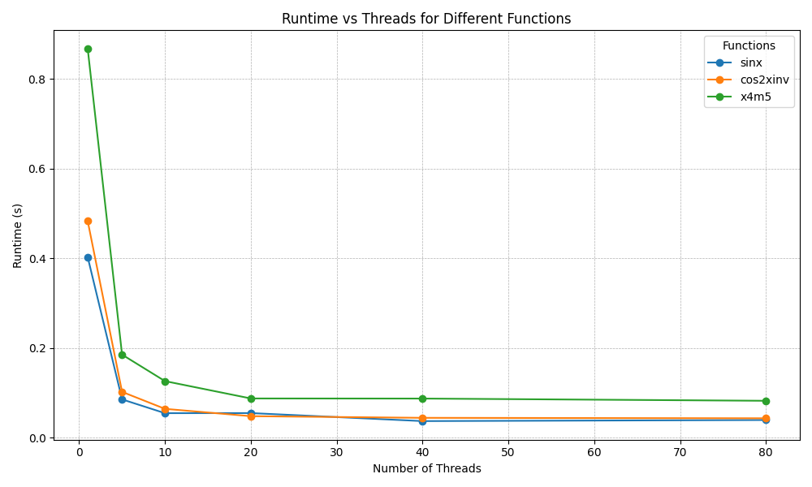

# Report Task 3
## Parallelization of a Monte-Carlo-Integration using OpenMP

The given task was to implement an algorithm to calculate the integrale of 3 functions (sin(x), cos^2(1/x), 5*x^4) using the monte-carlo technique.
To increase the accuracy and reduce the runtime, we use the OpenMP library to parallelize our for-loop among multiple threads. 
The compiled executable will then be ran on the cluster and to benchmark the code/cluster, we use 6 numbers of threads (1, 5, 10, 20, 40 and 80) for each of the function for the given interval -pi/2 to pi/2 and 10^7 samples. The output is plotted via a python script.

As expected, the runtime decreases drastically for higher number of threads but is limited due to the low number of samples vs high computation power. We would guess that for 10^8 or 5*10^8 the difference between 20 and 80 threads would be significally higher.